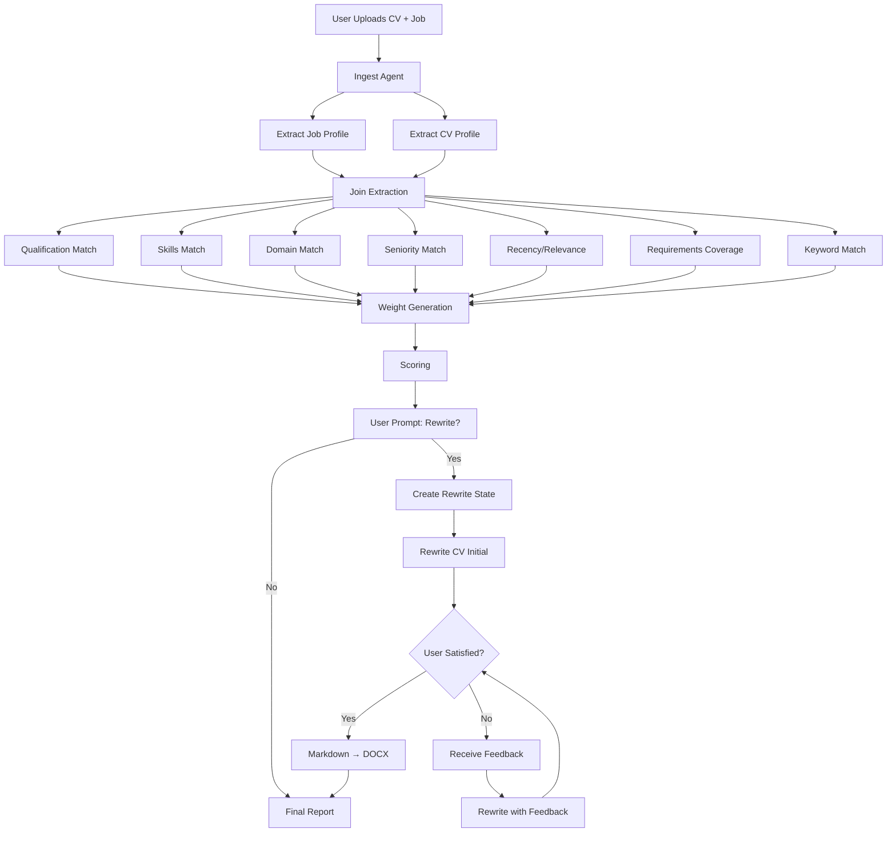
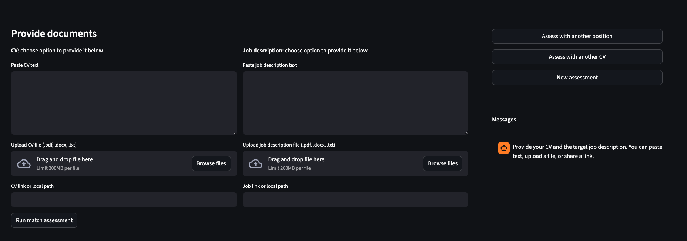
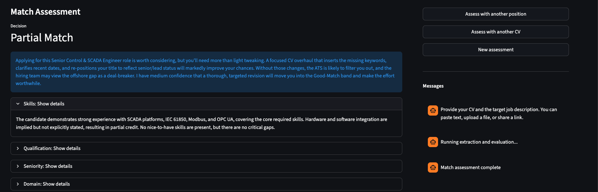
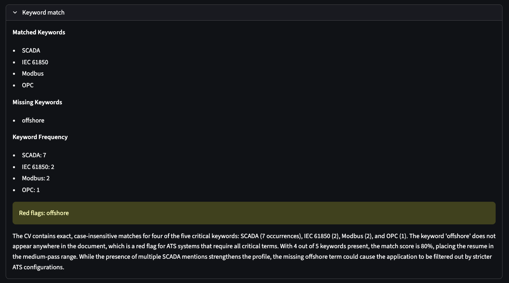
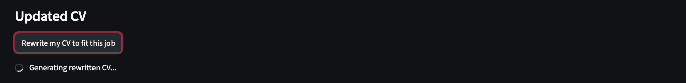
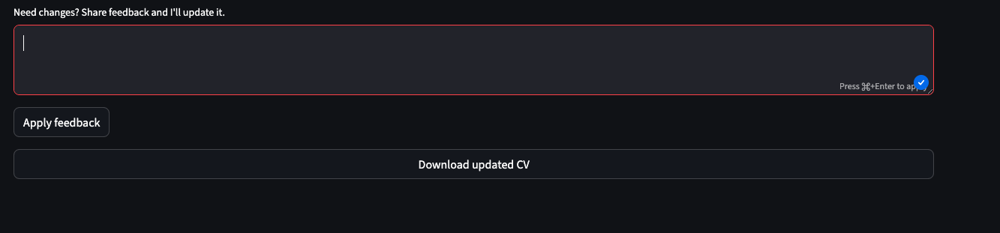

# Multi-Agent CV ↔ Job Matching System

This project implements a **multi-agent orchestration system** for
evaluating how well a candidate's CV matches a specific job description
and, when appropriate, generating **targeted rewrite recommendations**.

The system is built as a **decision-driven agent graph** with parallel
evaluators, centralized scoring, conditional routing, and optional
human-in-the-loop rewriting.

It is designed as a **product-style GenAI system**, not a simple prompt
chain.

------------------------------------------------------------------------

## Core Idea

Input (PDF / DOCX / TXT): - CV - Job description

Output: - Match decision - Structured explanation: - what fits
well - what is missing or weak - Recommendation: - no rewrite needed -
rewrite recommended - position not relevant - Optional: - fully rebuilt
CV aligned to the target role

The system separates **evaluation, decision-making, and generation**
into independent agents.

------------------------------------------------------------------------

## System Architecture Overview

1.  **Text Ingestion**
    -   CV and job description are converted into clean, normalized
        text.
2.  **Structured Extraction**
    -   Both texts are converted into validated structured objects
3.  **Parallel Evaluation (Multi-Agent)** Independent agents analyze
    different alignment dimensions at the same time:
    -   hard qualification requirements
    -   technical skills
    -   domain relevance
    -   seniority and experience level
    -   recency and relevance of experience
    -   requirements coverage (must-haves/nice-to-haves)
    -   ATS keyword match
4.  **Weight Generation** A dedicated agent produces dynamic weights
    based on the role type and requirements.
5.  **Centralized Scoring** A dedicated scoring agent:
    -   aggregates all evaluation signals
    -   computes the final match score
    -   generates a structured explanation and recommendation
6.  **Decision Routing** The user is prompted to decide whether to
    rewrite the CV.
7.  **Conditional Rewrite (Optional)** If the user approves rewriting:
    -   an optimized CV is generated
    -   a feedback loop refines the output
    -   a DOCX is exported at the end

------------------------------------------------------------------------

## Orchestration Graph

------------------------------------------------------------------------

## Key Properties

-   Deterministic decision flow
-   Explainable scoring
-   Modular agent design
-   Parallel evaluation
-   No unnecessary full-CV rewriting
-   Human-controlled rewrite activation

------------------------------------------------------------------------

## Technology Direction

The system is designed to be implemented using: - agent orchestration
graph - structured extraction - schema-validated state - centralized
scoring and conditional routing

Exact implementation details are intentionally decoupled from this
high-level design.

------------------------------------------------------------------------

## Project Status

This repository focuses on: - multi-agent orchestration logic -
decision-driven CV alignment - explainable AI evaluation - safe
controlled rewriting

For an interactive experience, you can also run the Streamlit app in
`cv_agent/app.py` to upload/paste a CV and job description, assess the
match, and optionally rewrite/download the CV.

## Streamlit App (screens)

- Run `streamlit run cv_agent/app.py`
1. Submit your CV and the target job for assesment

2. Recieve assesment on the match with detailed information and recomendations

3. Get your CV rewritten using target job language and Applicant Tracking System recomendations and formatting

4. Update CV with your feedback if needed

5. Download updated CV in docx format

Notes:
- Match results include a Strengths & gaps summary and per-section expanders. Matched/missing items and must-haves/nice-to-haves show in side-by-side columns when available; empty sections stay hidden.
